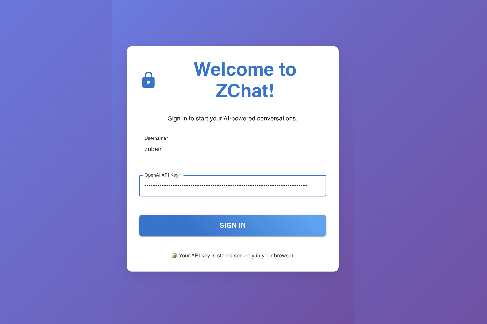
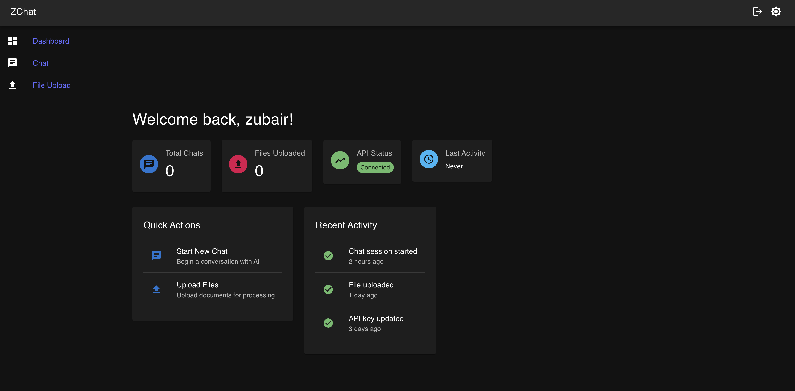
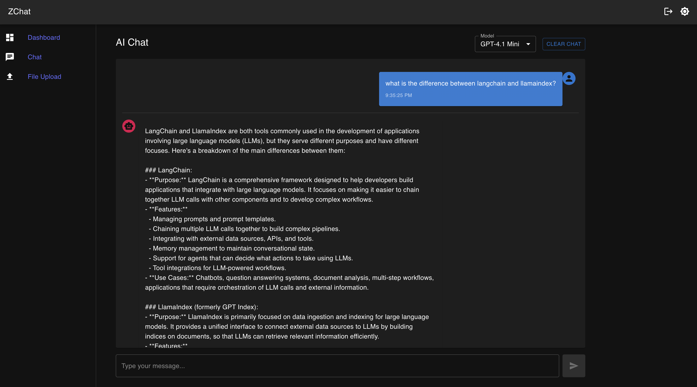

# ZChat

Welcome to **ZChat** – your personal, AI-powered chat and productivity hub, crafted by Zubair Farahi! 🚀

## What is ZChat?
ZChat is a modern, full-stack AI chat and file upload platform. It’s built for speed, style, and serious fun. Whether you want to chat with AI, upload files, or just show off your React chops, ZChat is your playground.

## Features

- 🔐 **Secure Login**: Sign in with your OpenAI API key (securely stored in your browser)
- 🏠 **Personalized Dashboard**: See your stats, recent activity, and quick actions
- 💬 **AI Chat**: Real-time, streaming conversations with your favorite AI models
- 📁 **File Upload**: Drag-and-drop files, track upload progress, and manage your docs
- 🌙 **Dark Mode**: Toggle between light and dark for day or night hacking
- 🚪 **Logout**: One-click logout for privacy and demo resets
- 📱 **Responsive**: Looks great on any device

---

## ✨ See ZChat in Action!

### 🚪 Login Page

*Sign in and get started with a beautiful, modern UI!*

### 🏠 Dashboard

*Your personal AI command center: stats, quick actions, and recent activity.*

### 💬 Chat Interface

*Chat with AI in real time, with streaming responses and model selection!*

---

## Tech Stack
- **React 19** + Vite (blazing fast!)
- **Material UI** (for that sweet, modern look)
- **React Router** (smooth navigation)
- **FastAPI** backend (make sure it’s running on `localhost:8000`)

## Getting Started

### 1. Clone & Install
```bash
cd frontend
npm install
```

### 2. Run ZChat Locally
```bash
npm run dev
```
Visit [http://localhost:5173](http://localhost:5173) in your browser.

### 3. Backend
Make sure your FastAPI backend is running at `localhost:8000`.

### 4. Login
- Enter your username and OpenAI API key
- Click **Sign In**
- Your credentials are stored securely in your browser (localStorage)

### 5. Logout
- Click the logout icon (top right) to sign out and clear your credentials

## Project Structure
```
frontend/
├── src/
│   ├── components/
│   │   ├── LoginPage.jsx
│   │   ├── DashboardPage.jsx
│   │   ├── ChatPage.jsx
│   │   └── FileUploadPage.jsx
│   ├── App.jsx
│   ├── main.jsx
│   └── index.css
├── public/
├── screenshots/
│   ├── August 11, 2024.jpg
│   ├── August 14, 2024.jpg
│   └── May 28, 2025.jpg
├── package.json
└── README.md
```

## Deployment
ZChat is Vercel-ready! Just run:
```bash
vercel
```

## Troubleshooting
- **Backend not connecting?** Make sure FastAPI is running and CORS is enabled.
- **API key issues?** Double-check your OpenAI key and browser console for errors.
- **Build errors?** Try `rm -rf node_modules && npm install`.

## Credits
Made with ❤️ by Zubair Farahi. Inspired by the power of AI and the joy of building cool stuff.

---

Ready to chat smarter? Fire up ZChat and let the conversations begin! 😎
